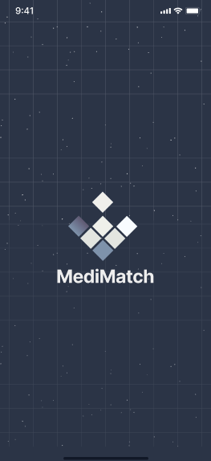
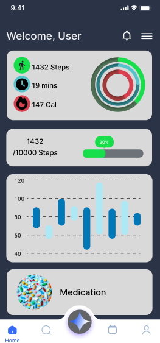
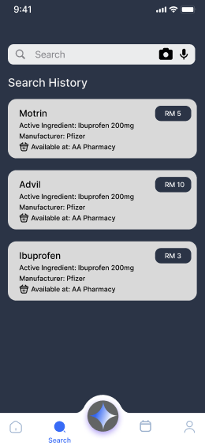
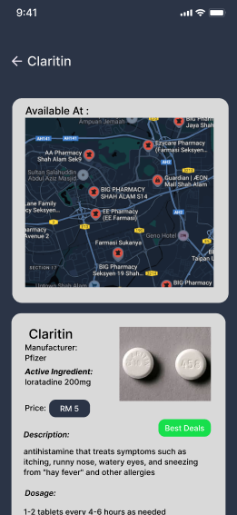
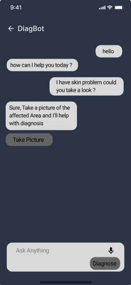
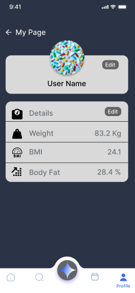

# **MediMatch**
Introducing **MediMatch**! An AI-powered mobile app designed to support users with medication tracking, finding alternative medicines, and offering personalized recommendations for health management. MediMatch integrates expert AI agents to provide a comprehensive solution for smarter medication management.

## Features

- 🏥 **Medication Tracking & Reminders**  
  Keep track of your medications, receive reminders, and never miss a dose with our AI-powered system.

- 🧠 **AI-powered Medicine Suggestions**  
  Get alternative medicines based on active ingredients, availability, and price from nearby pharmacies using real-time data.

- 📊 **Prescription Analysis with AI Vision**  
  Scan and analyze prescriptions using AI-powered OCR to identify medications, doses, and instructions.

- 💊 **Medication Knowledge Base**  
  Access an extensive database of medications, including information on side effects, usage, and interactions.

- 🌍 **Find Nearby Pharmacies with Google Maps**  
  Locate pharmacies near you that carry the prescribed or alternative medications, and view them on an interactive map.

- 🏷️ **Dynamic Dosage Adjustment**  
  Get recommendations for dosage adjustments based on active ingredients, dosage strength, and medical guidelines.

## Screenshots

<p align="center">
  
  
</p>
<p align="center">
  
  
</p>
<p align="center">
  
  
</p>

## Tech Stack

- **Client:** Flutter
- **Server:**  Google AI (Vision AI, Gemini), Google Maps API
- **AI Technologies:** Google AI Studio, Vertex AI, Gemini (for AI-powered insights)
- **Database:** Firebase Firestore (real-time data storage)
- **Authentication:** Firebase Authentication
- **Cloud Functions:** Google Cloud Functions for backend processing

## Installation

Install **MediMatch** with Flutter:

```bash
git clone https://github.com/yourusername/MediMatch.git
cd MediMatch
flutter pub get
flutter run
```

## Dependencies

-   `http: ^0.13.5`
-   `fl_chart: ^0.70.2`
-   `percent_indicator: ^4.2.3`
-   `image_picker: ^1.1.2`
-   `google_maps_flutter: ^2.0.6`
-   `firebase_auth: ^3.3.4`
-   `firebase_firestore: ^3.1.5`

## API Integration

- **Google Vision AI**  
  Used for prescription and medication identification via OCR.

- **Google Gemini**  
  Utilized for personalized medicine suggestions and dosage adjustments based on user input and medical data.

- **Google Maps API**  
  Helps users locate pharmacies near them that carry prescribed or alternative medicines.

- **Firebase**  
  Provides backend storage and real-time database for user data, medication schedules, and reminders.

## Features Breakdown

- **Medication Tracking & Reminders:**  
  The app allows users to track medications and receive AI-powered reminders, ensuring no dose is missed. Firebase handles the backend for real-time updates and push notifications.

- **AI-powered Medicine Suggestions:**  
  Users can search for alternative medications based on active ingredients, prices, and availability at local pharmacies using the **Google Maps API**. **Google Gemini** is utilized to provide smart recommendations based on the user’s medical history and preferences.

- **Prescription Analysis with AI Vision:**  
  The app’s **AI Vision** feature lets users scan prescriptions using the camera, allowing the AI to extract key data such as the drug name, dosage, and frequency.

- **Nearby Pharmacy Locator:**  
  With **Google Maps API**, the app can show nearby pharmacies where users can find medications and compare prices for alternatives.

- **Dynamic Dosage Adjustment:**  
  Users will receive AI-powered suggestions for dosage adjustments based on active ingredients and medical guidelines.

## Usage

- **AI-Powered Features:**  
  All AI-powered suggestions and analyses (medication recommendations, dosage adjustments, etc.) rely on **Google AI Studio**, **Gemini**, and **Vertex AI**.

- **Cloud Integration:**  
  Firebase Authentication and Firestore are used for user sign-ins, real-time updates, and storing medication data. All data is securely stored and processed in the cloud.
